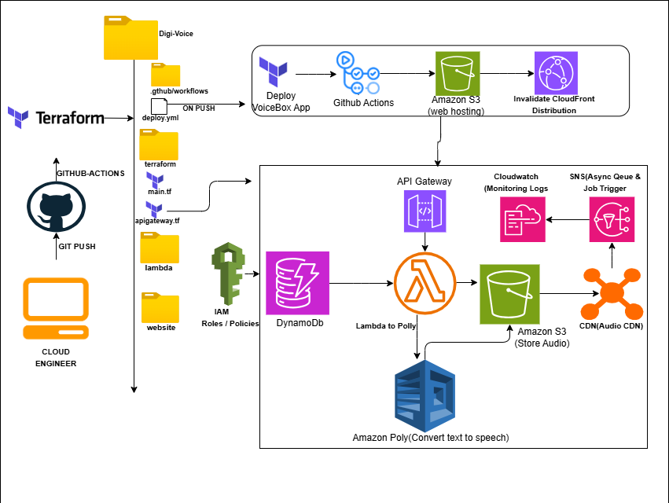

# 🎙️ VoiceBox - Text-to-Speech Application

A modern, serverless text-to-speech application that converts text into lifelike speech using browser-based synthesis and AWS services. Built with a beautiful yellow/brown theme and supporting 20+ languages.

  

## ✨ Features

- 🌍 **Multi-language Support** - 20+ languages including English, Spanish, French, German, Japanese, Chinese, and more
- 🎵 **Audio Download** - Save generated speech as WAV files
- ⚡ **Instant Playback** - Browser-based synthesis for immediate results
- 🎨 **Modern UI** - Beautiful yellow/brown/white/black theme with smooth animations
- 📱 **Responsive Design** - Works perfectly on desktop, tablet, and mobile
- 🔒 **No Authentication** - Direct access without signup requirements
- ☁️ **Serverless Architecture** - Built on AWS for scalability and reliability

## 🚀 Live Demo

Visit the live application: [VoiceBox](https://your-cloudfront-url.cloudfront.net)

## 🏗️ Architecture

VoiceBox uses a hybrid architecture combining:
- **Frontend**: Browser Speech Synthesis API for instant results
- **Backend**: AWS serverless services for scalable processing
- **Storage**: S3 for audio files and static hosting
- **CDN**: CloudFront for global content delivery



## 🛠️ Technology Stack

| Component | Technology |
|-----------|------------|
| **Frontend** | HTML5, CSS3, JavaScript (jQuery) |
| **Speech Synthesis** | Web Speech API, Web Audio API |
| **Cloud Platform** | Amazon Web Services (AWS) |
| **Compute** | AWS Lambda (Python 3.9) |
| **Database** | Amazon DynamoDB |
| **Storage** | Amazon S3 |
| **CDN** | Amazon CloudFront |
| **API** | AWS API Gateway |
| **TTS Service** | Amazon Polly |
| **Messaging** | Amazon SNS |
| **Infrastructure** | Terraform |
| **CI/CD** | GitHub Actions |

## 📋 Prerequisites

- AWS Account with appropriate permissions
- Terraform >= 1.6.6
- Node.js (for local development)
- Git

## 🚀 Quick Start

### 1. Clone the Repository
```bash
git clone https://github.com/your-username/digi-voice.git
cd digi-voice
```

### 2. Configure AWS Credentials
```bash
aws configure
# Enter your AWS Access Key ID, Secret Access Key, and region (us-east-1)
```

### 3. Deploy Infrastructure
```bash
cd terraform
terraform init
terraform plan
terraform apply
```

### 4. Deploy Frontend
```bash
# Frontend is automatically deployed via GitHub Actions
# Or manually upload website/ contents to S3 bucket
aws s3 sync website/ s3://your-bucket-name
```

### 5. Access Application
Open your CloudFront distribution URL in a web browser.

## 📁 Project Structure

```
digi-voice/
├── 📁 website/                 # Frontend application
│   ├── index.html             # Main HTML file
│   ├── styles.css             # Custom styling
│   ├── script.js              # JavaScript logic
│   └── auth.js                # Authentication (legacy)
├── 📁 terraform/              # Infrastructure as Code
│   ├── main.tf                # Main configuration
│   ├── s3.tf                  # S3 buckets
│   ├── lambda.tf              # Lambda functions
│   ├── apigateway.tf          # API Gateway
│   ├── dynamodb.tf            # Database
│   └── ...                    # Other AWS resources
├── 📁 lambda/                 # Lambda function code
│   ├── handler.py             # New post handler
│   ├── get_post.py            # Get post handler
│   ├── voices.py              # Voices handler
│   ├── convert_to_audio.py    # Audio conversion
│   └── direct_audio.py        # Direct audio generation
├── 📁 .github/workflows/      # CI/CD pipeline
│   └── deploy.yml             # GitHub Actions workflow
├── ARCHITECTURE.md            # Detailed architecture documentation
└── README.md                  # This file
```   📁docs

## 🎯 Usage

### Basic Text-to-Speech
1. **Enter Text**: Type or paste your text in the input area
2. **Select Voice**: Choose from available system voices grouped by language
3. **Convert**: Click "Convert to Speech" button
4. **Listen**: Audio plays automatically with playback controls
5. **Download**: Save the generated audio as a WAV file

### Supported Languages
- 🇺🇸 English (US, UK, Australia)
- 🇪🇸 Spanish (Spain, Mexico)
- 🇫🇷 French (France)
- 🇩🇪 German (Germany)
- 🇮🇹 Italian (Italy)
- 🇵🇹 Portuguese (Brazil)
- 🇯🇵 Japanese (Japan)
- 🇰🇷 Korean (Korea)
- 🇨🇳 Chinese (Simplified, Traditional)
- 🇷🇺 Russian (Russia)
- 🇸🇦 Arabic (Saudi Arabia)
- 🇮🇳 Hindi (India)
- And many more...

## 🔧 Configuration

### Environment Variables
```bash
# AWS Configuration
AWS_REGION=us-east-1
AWS_ACCESS_KEY_ID=your-access-key
AWS_SECRET_ACCESS_KEY=your-secret-key

# S3 Buckets
WEBSITE_BUCKET=polly-app-static-website-20251809
AUDIO_BUCKET=mp3-pollybucket-app-20251809
```

### Terraform Variables
```hcl
# terraform/variables.tf
variable "region" {
  default = "us-east-1"
}

variable "environment" {
  default = "production"
}
```

## 🚀 Deployment

### Automatic Deployment (Recommended)
Push to the `master` branch to trigger automatic deployment via GitHub Actions:

```bash
git add .
git commit -m "Your changes"
git push origin master
```

### Manual Deployment
```bash
# Deploy infrastructure
cd terraform
terraform apply

# Deploy frontend
aws s3 sync website/ s3://your-website-bucket
aws cloudfront create-invalidation --distribution-id YOUR_DISTRIBUTION_ID --paths "/*"
```

## 🧪 Testing

### Test API Endpoints
Click the "Test API" button in the application to verify:
- Speech synthesis functionality
- Voice availability
- Audio recording capabilities

### Local Testing
```bash
# Serve frontend locally
cd website
python -m http.server 8000
# Visit http://localhost:8000
```

## 📊 Monitoring

### AWS CloudWatch
- Lambda function logs and metrics
- API Gateway request/response logs
- DynamoDB performance metrics
- S3 access logs

### Application Metrics
- Speech synthesis success rate
- Audio download statistics
- User engagement metrics
- Error rates and performance

## 🔒 Security

- **HTTPS Enforcement**: All traffic encrypted via CloudFront
- **CORS Protection**: Configured for cross-origin security
- **IAM Roles**: Least privilege access for all AWS services
- **Data Encryption**: At rest and in transit
- **No Authentication**: Public access by design (can be changed)

## 💰 Cost Optimization

- **On-demand Pricing**: DynamoDB and Lambda scale with usage
- **S3 Lifecycle Policies**: Automatic cleanup of old audio files
- **CloudFront Caching**: Reduces origin requests
- **Efficient Lambda Functions**: Optimized execution time

## 🤝 Contributing

1. Fork the repository
2. Create a feature branch (`git checkout -b feature/amazing-feature`)
3. Commit your changes (`git commit -m 'Add amazing feature'`)
4. Push to the branch (`git push origin feature/amazing-feature`)
5. Open a Pull Request

## 📝 License

This project is licensed under the MIT License - see the [LICENSE](LICENSE) file for details.

## 🆘 Support

### Common Issues

**Q: Speech synthesis not working?**
A: Ensure your browser supports the Web Speech API. Try Chrome, Firefox, or Safari.

**Q: No voices available?**
A: Refresh the page or check your system's text-to-speech settings.

**Q: Download not working?**
A: Audio download requires modern browser support for Web Audio API.

### Getting Help
- 📧 Email: support@voicebox.com
- 💬 Issues: [GitHub Issues](https://github.com/your-username/digi-voice/issues)
- 📖 Documentation: [Architecture Guide](./ARCHITECTURE.md)

## 🙏 Acknowledgments

- **Amazon Web Services** for the robust cloud platform
- **Web Speech API** for browser-based synthesis
- **Terraform** for infrastructure as code
- **GitHub Actions** for seamless CI/CD

## 📈 Roadmap

### Version 2.0 (Planned)
- [ ] User authentication and profiles
- [ ] Voice cloning capabilities
- [ ] Batch text processing
- [ ] Advanced SSML support
- [ ] Multi-format audio export
- [ ] API rate limiting
- [ ] Analytics dashboard

### Version 1.1 (Current)
- [x] Multi-language support
- [x] Audio download functionality
- [x] Modern UI/UX design
- [x] Serverless architecture
- [x] Browser-based synthesis

---

**Made with ❤️ by Raphew Karim Issah**

**⭐ Star this repository if you found it helpful!**